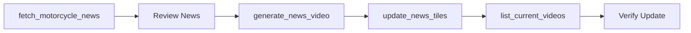

# Tools Overview

The MCP News Generator provides four powerful tools for managing motorcycle news content.

## Available Tools

### 1. fetch_motorcycle_news

Fetches the latest motorcycle news from various RSS feeds.

**Capabilities:**
- Aggregate news from multiple sources
- Filter by specific news source
- Limit number of results
- Parse RSS/Atom feeds

**Parameters:**

| Parameter | Type | Required | Default | Description |
|-----------|------|----------|---------|-------------|
| `source` | string | No | "all" | News source: motorcyclenews, cycleworld, rideapart, revzilla, or all |
| `limit` | integer | No | 10 | Maximum number of items to fetch |

**Example Usage:**

```
Fetch the latest 5 news items from motorcyclenews
```

**Response Format:**

```json
{
  "source": "motorcyclenews",
  "title": "BMW Unveils New R 1300 GS",
  "description": "German manufacturer announces flagship adventure bike...",
  "link": "https://www.motorcyclenews.com/...",
  "published": "2025-12-22T10:00:00Z"
}
```

---

### 2. generate_news_video

Creates a 3-second video clip with text overlay from news content.

**Capabilities:**
- Generate video from text
- Customizable text styling
- Category-based organization
- Automatic file naming
- HD quality output

**Parameters:**

| Parameter | Type | Required | Default | Description |
|-----------|------|----------|---------|-------------|
| `title` | string | Yes | - | Video title/headline (max 50 chars) |
| `description` | string | Yes | - | Brief description (max 100 chars) |
| `category` | string | Yes | - | One of: electric, racing, luxury, tech, classic, industry |
| `background_color` | string | No | "#1a1a1a" | Hex color code for background |

**Example Usage:**

```
Generate a video with:
- Title: "BMW R 1300 GS Launch"
- Description: "New flagship adventure bike with enhanced features"
- Category: racing
```

**Response Format:**

```json
{
  "success": true,
  "filename": "racing_bmw_r_1300_gs_launch_20251222_103045.mp4",
  "path": "C:\\...\\videos\\racing_bmw_r_1300_gs_launch_20251222_103045.mp4",
  "videoUrl": "videos/racing_bmw_r_1300_gs_launch_20251222_103045.mp4"
}
```

**Video Specifications:**
- Resolution: 1920x1080 (Full HD)
- Duration: 3 seconds
- FPS: 24
- Codec: H.264 (libx264)
- Format: MP4

---

### 3. update_news_tiles

Updates the autoclip project's script.js with new video entries.

**Capabilities:**
- Append new videos
- Replace all videos
- Maintain ID sequencing
- Preserve existing formatting
- Backup-friendly operations

**Parameters:**

| Parameter | Type | Required | Default | Description |
|-----------|------|----------|---------|-------------|
| `videos` | array | Yes | - | Array of video objects to add |
| `mode` | string | No | "append" | "append" to add, "replace" to replace all |

**Video Object Structure:**

```json
{
  "title": "Video Title",
  "description": "Video description",
  "category": "racing",
  "videoUrl": "videos/filename.mp4",
  "date": "2025-12-22"
}
```

**Example Usage:**

```
Update the news tiles with these videos:
- Title: "BMW R 1300 GS Launch", category: racing, videoUrl: videos/...mp4
in append mode
```

**Response:**

```
Successfully added 1 video(s) to script.js
```

---

### 4. list_current_videos

Lists all currently configured videos in the autoclip project.

**Capabilities:**
- View all videos
- Check current count
- Preview configuration
- Verify updates

**Parameters:**

None required.

**Example Usage:**

```
List current videos
```

or

```
Show me all the videos currently configured
```

**Response Format:**

```
Found 15 videos configured in script.js

Preview:
{ id: 1, title: "BMW R 1300 GS Launch", description: "...", category: "racing", ... },
{ id: 2, title: "Ducati Panigale V4", description: "...", category: "luxury", ... },
...
```

## Tool Workflow

The tools are designed to work together in a natural workflow:



## Error Handling

All tools include comprehensive error handling:

- **Network errors**: Timeout and retry logic
- **File errors**: Permission and path validation
- **Parse errors**: Graceful fallbacks
- **Validation errors**: Clear error messages

## Best Practices

1. **Fetch News First**: Always start by fetching news to get fresh content
2. **Review Before Generating**: Check news items before creating videos
3. **Test Videos**: Generate one video first to verify settings
4. **Backup script.js**: Keep backups before using "replace" mode
5. **Verify Updates**: Always list videos after updating

## Next Steps

- [Fetching News Guide](fetching-news.md) - Detailed news fetching guide
- [Generating Videos Guide](generating-videos.md) - Video generation tips
- [Updating Tiles Guide](updating-tiles.md) - Managing tile updates
